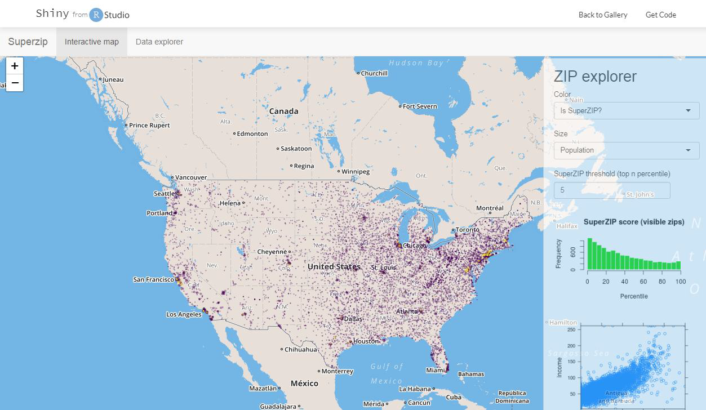
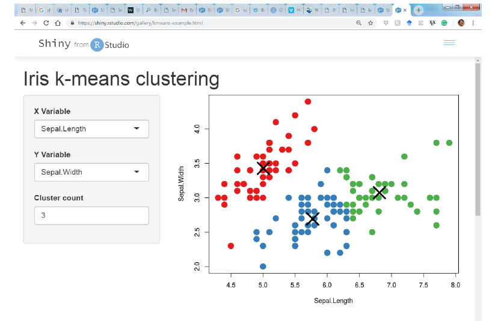
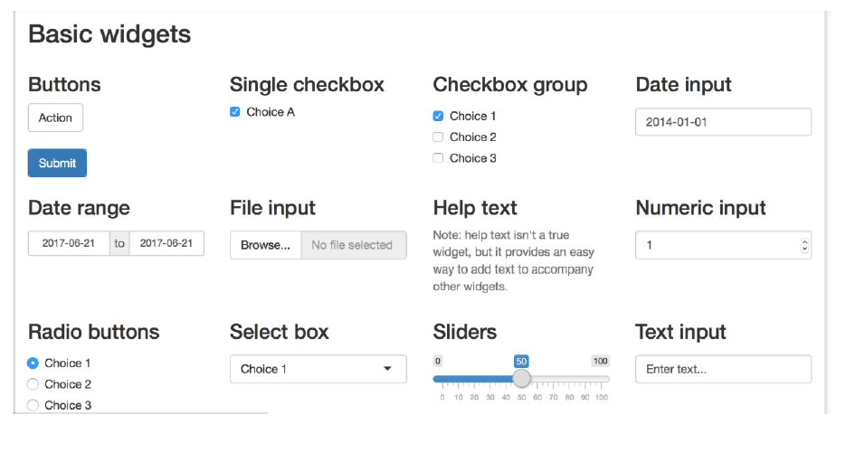
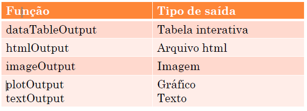
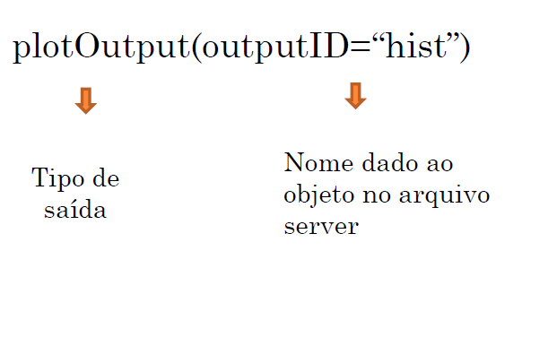
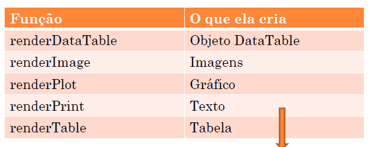
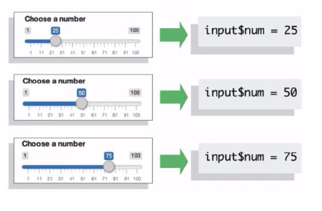

```{r setup, include=FALSE}
#devtools::install_github("yihui/xaringan")
options(htmltools.dir.version = FALSE)
```


class: center, middle


# Por que Shiny?


---

background-image: url("https://media.giphy.com/media/c3MEOYK3O8POo/giphy.gif")
background-position: 50% 50%
class: center, inverse


---

background-image: url(figs/spreadsheetcombo.png)
background-position: center;

class: middle, center

# Motivação

## Muitas tabelas que precisam ser representadas!!

---

## Motivação

<font style="color: darkorange;">"Você pode fazer mais um gráfico? Obrigada! Mas, agora preciso de mais um gráfico, acho que pode ter uma relação diferente só com esse grupo de observações. Ok, mas precisava de mais uma análise, pode ser? Ah agora sim acho que acabou a análise, mas peraí, acho que preciso de mais um, adivinha, gráfico? Análise? Filtro de observações, ..."</font>

</img>

---

background-image: url("https://media.giphy.com/media/TseBjMu53JgWc/giphy.gif")
background-position: 50% 50%
class: center, inverse

---


background-image: url(figs/toomanyplots.png)
background-repeat: repeat-x;


# Você pode fazer mais um gráfico? O problema dessa pergunta é que:

---

background-image: url(figs/toomanyplots.png)
background-repeat: repeat-x;


# Você pode fazer mais um gráfico? O problema dessa pergunta é que:


# dependendo do banco há infinitas possibilidades e combinações de variáveis ou/e de filtros.

---


# Como resolver isso? 

--

background-image: url(figs/shinyhex.png)
background-position: 50% 50%
background-size: 50%


---

# Minha motivação

### Núcleo de Avaliação da Unidade (NAU): representar diferentes combinações possíveis de variáveis de avaliação  <font style="color: darkorange;">one data set</font>

- <font style="color: darkorange;"> Explorar, visualizar, divulgar</font>
- Especificar uma pergunta do questionário ou considerar somente alunos da estatística, matemática, outros cursos, ...  

---

# Minha motivação


### Datathon

</img>


---

class: middle, center, inverse

# Motivação de todos:


## Divulgação!

--

## Interatividade entre o usuário! 

--

## Pode ser que precisemos focar em variáveis específicas, ou em grupo de observações, com o shiny podemos juntar todas as possibilidades!!! 


---

#  *Collaborator:* "Como posso compartilhar os meus dados"

--

</img>
<https://kcvi.shinyapps.io/START_HT/>


---

# *Estatísticos/Cientistas de dados*: <br>"Como fazer as pessoas utilizarem a metodologia que eu criei ou o meu pacote?"

--

</img>
<http://qvalue.princeton.edu/>


---

# *Estatísticos/Cientistas de dados*: <br> Olhe a análise que eu fiz!!

--

</img>
<https://gallery.shinyapps.io/TSupplyDemand/>


---

# *Estatísticos/Cientistas de dados*: <br> Visualização em mapas!

--

</img>
<https://gallery.shinyapps.io/>


---

# *Ensinar R e estatística! (`learnr`)

--

</img>
<https://minnier.shinyapps.io/ODSI_continuousData/>

---

# Resumindo;

## O que é Shiny:

* Pacote do R.

* Permite criar apps interativos.

* Esses apps podem ficar disponíveis no seu usuário na página do shiny.io.

* Podem ser inseridos em arquivos R Markdown

## Uma ótima ferramenta para apresentar resultados de qualquer análise de dados.

---

# Cursos on-line: 

## Datacamp

## Rstudio

# Vários exemplos disponíveis

### <https://gallery.shinyapps.io/LDAelife/>

### <http://www.dataseries.org/>

### <https://www.showmeshiny.com/>


---

# COMEÇANDO PELO COMEÇO...

* É necessário já ter uma certa habilidade com o R.
* O Shiny possui sua lógica própria.
* Todos gráficos e análises realizadas no R podem se incluídas dentro do seu App.
* Como eu comecei?

--
* Editando os apps que encontrava online.

--
* Esse é o caminho mais longo.
* Não entende a lógica e faz o código na força bruta.
* Como eu recomendo?
* Entenda lógica das funções.

---

# COMPONENTES DO APLICATIVO

## Todo o aplicativo tem dois componentes:

### ui.r e server.R

---

# ui.r


### Aqui é onde está a interface com o usário.

### Onde podemos escolher o filtro, tamanho de amostra, gráfico, ...

### Título, como as informações serão apresentadas, o que será apresentado.

###  O R cria um arquivo Html a partir do seu código.


---

# server.r

### Instruções para o servidor.

### Nessa parte você coloca todo seu código.

### Suas análises, a construção dos gráficos, etc.

### O servidor vai fazer tudo sozinho a partir das suas instruções e ele vai interagir com o usuário.

### Aqui está o coração do seu código.

---

# App.R

### É possível colocar as duas componentes ui.R e server.R em um único arquivo o app.R

### Isso pode ser um problema dependendo do tamanho do seu código

### Seu código vai crescendo à medida que vai acrescentando mais ferramentas, o programa pode ficar muito grande e fica mais complicado de descobrir erros.


---

# Estrutura básica do arquivo ui.R

```{r, eval=FALSE}

ui <- fluidPage(
  # *Input() functions,
  # *OUtput() functions

)
```

---
# Estrutura básica do arquivo ui.R
## Input

* Funções de entrada dos dados.
* Vão depender do tipo de informação você precisa coletar.
* Usuário vai digitar um número? 


```{r, eval=FALSE}

numericInput(inputId, label, value, min=NA, max=NA, step=NA, width = NULL)

```

* _inputId_ é o nome da variável no seu código.
* _label_ é o nome que vai aparecer para o usuário
* _value_ o valor usado antes do usuário digitar qualquer valor ( é sempre necessário)
* _Opcionais_: 

* min, max faixa de valores permitidos 
* step se não quiser permitir números quebrados 
* width é a larguda da caixa

---

## Input

O usuário vai selecionar uma opção?


```{r, eval=FALSE}

selectInput(inputId, label, choices, selected = NULL, multiple = FALSE, selectize = TRUE, width = NULL, size = NULL)

```

* inputId é o nome da variável no seu código.

* label é o nome que vai aparecer para o usuário

* choices as opções que ele terá (Masculino, Feminino)

* Opcionais: selected a opção selecionada por default (considera a primeira se deixar em branco) 

* _multiple_ permite selecionar mais de uma opção

---

# Exemplo: 


</img>


---

# Outras opções de layout: 


</img>

---


# Output()


* Funções de saída dos dados.

* Podem ser o resultado de qualquer tipo de análise.

* Gráficos, tabelas, figuras, textos, mapas, etc.


</img>

---

### A função deve ser inserida no arquivo ui.R

</img>


---

# Exemplo: 


```{r, eval=FALSE}

ui = fluidPage(
  sliderInput(inputId = "num",
              label = "escolha um numero",
              value = 30, min = 1, max = 100),
  plotOutput("hist")
)

server = function(input, output) {}

shinyApp(ui = ui, server = server)

```

---

# Exemplo:

### Resultado da função anterior

</img>


---

# Exemplo: 


* Vamos definir o que é o objeto hist.
* Isso será feito no arquivo server.r
* O formato de saída é output$nome_objeto


```{r, eval=FALSE}

server = function(input, output){
  output$hist = #code
}
```

---

# Exemplo: 


* Para que o objeto de saída seja atualizado de acordo com as entradas ele tem que ser reativo
* Ele deve ser uma função do tipo render.
* Caso contrário ele é estático e não pode depender do input


```{r, eval=FALSE}

server = function(input, output){
  output$hist = renderPlot({
    
  })
}
```

---

# Exemplo:

* As funções do tipo render acompanham os tipos de output

</img>

---
# Exemplo:

* Vamos fazer um histograma de uma amostra de uma normal padrão de tamanho 100.

```{r, eval=FALSE}

renderPlot({his(rnorm(100))
  })

```

* _renderPlot_ é o tipo de objeto

* _hist_ é o código que constroi o objeto

---

# Exemplo:


```{r, eval=FALSE}
server = function(input, output){
  output$hist = renderPlot({
    title = "amostra aleatoria de uma normal de tamanho 100",
    hist(rnorm(100)), main=title
    
  })
}

```

---

# Exemplo:

* No exemplo anterior não usamos o input() na função.
* Vamos supor que o tamanho da amostra não será fixo em 100.
* O usuário vai determinar o tamanho da amostra.
* Esse valor estará salvo no objeto “num”


```{r, eval=FALSE}

sliderInput(inputId = "num", ...)

#input$num
```

---

# Exemplo:

* Esse valor vai ser atualizado de acordo com o que o usuário escolher.

</img>


---
# Exemplo:

* Esse valor agora será usado para definir o tamanho da amostra.


```{r, eval=FALSE}
server = function(input, output){
  output$hist = renderPlot({
    hist(rnorm(input$num))
    
  })
}

```

---

# Exemplo:

### Resultado

* Se modificar o valor escolhido o gráfico atualiza automaticamente (e rapidamente se o processamento no arquivo server não for demorado!)


</img>


---


# Shiny: básico

```{r, eval=FALSE}
# what you see, client side
ui <- fluidPage(
  

)
```

```{r, eval=FALSE}
# Cálculos aqui!
server <- function(input, output) {
  
  
  
  
}
```


```{r, eval=FALSE}
# run the app!
shinyApp(ui = ui, server = server)
```


---
# Shiny 

```{r, eval=FALSE}
# what you see, client side
ui <- fluidPage(
  # Title, panels
  plotOutput("myplot"), #from output$myplot
  selectInput("foo",choices=allthechoices)
)
```

```{r, eval=FALSE}
# computations here!
server <- function(input, output) {
  
  
  
  
}
```


```{r, eval=FALSE}
# run the app!
shinyApp(ui = ui, server = server)
```

---
# Shiny 

```{r, eval=FALSE}
# what you see, client side
ui <- fluidPage(
  # Title, panels
  plotOutput("myplot"), #from output$myplot
  selectInput("foo",choices=allthechoices)
)
```

```{r, eval=FALSE}
# computations here!
server <- function(input, output) {
  # reactive plots
  output$myplot <- renderPlot({ ggplot(yay) + geom_point() })
  # use input$foo here, maybe observe changes in UI
  observe({ dostuff(input$foo) })
}
```


```{r, eval=FALSE}
# run the app!
shinyApp(ui = ui, server = server)
```

---

https://github.com/rladies/rshinylady


---

# Como colocar seu App on-line

1. Crie uma conta no http://www.shinyapps.io/

2. Passo 2: Rode o app na sua máquina e clique em Publish


---

background-position: 50% 50%
class: center, inverse, middle


# Dicas: 

* Você só consegue colocar online no máximo 5 apps por conta.

* Aplicativo tem um limites de horas.

* Se tem vários clientes que vão ficar horas olhando os resultados vai precisar de uma conta paga.

* VOcê pode pagar só um mês.


---

background-position: 50% 50%
class: center, inverse, middle


# Dica: 

* Todas as bases de dados usadas devem ser copiadas para a pasta do seu app. 

* Não é possível trabalhar com palavras acentuadas (pelo menos que eu saiba!!), nem nos arquivos nem no app.


---

background-position: 50% 50%
class: center, inverse, middle


# Dica: se sua base de dados é muito grande, ou a análise leva muito tempo (maxima verossimilhaná por exemplo), salve as bases pré-processadas. Como o aplicativo no site do shiny faz tudo em tempo real, pode levar muito tempo para abrir os resultados.

---

# Um exemplo: app STAR

<font style="color: darkorange;">S</font>hiny 
<font style="color: darkorange;">T</font>ranscriptome
<font style="color: darkorange;">A</font>nalysis
<font style="color: darkorange;">R</font>esource
<font style="color: darkorange;">T</font>ool

<br>
Github: [https://github.com/jminnier/STARTapp](https://github.com/jminnier/STARTapp)

<br>
<font style="color: green;">
DATA = <em>RNA-seq gene expression</em>
</font>


---

# Tour muito rápido


---

# Tour muito rápido


<!--- https://gist.github.com/dergachev/4627207 for screencast to gif --->


---

# Distribuição dos dados, interatividade


---

# Análise de resultados, interatividade


---

# Análise exploratória, interatividade


---
class: inverse, middle, center

# Considerações

---

# Importante saber quais serão os usuários do aplicativo!

## Examplo: START app

- provavelmente biólogos
- o aplicativo não pode ser usado para codificação ou grandes conjuntos de dados

</img>
---

# Desafios: 

Fazer que a busca seja interativa  </font> boxes/filtros + <font style="color: darkorange;">Reactive visualization</font>


---


# Landing page - Onde eu estou?

- <font style="color: darkorange;">Mostra</font> o que o app podefazer

Bonus: [Jasmine Dumas](https://jasdumas.github.io/) has a [`shinyLP`](https://github.com/jasdumas/shinyLP) package to help!
</img>

---

# Novos métodos são úteis

`runApp(..., display.mode="showcase")`

Mas, não mostram porque alguma coisa não funciona.

</img>


---


# Mais dicas

- Teste primeiro
    + Testar o aplicativo antes de disponibilizá-lo pode poupar muita dor de cabeça (packages: [`testthat`](http://testthat.r-lib.org/), [`shinytest`](https://rstudio.github.io/shinytest/))
    + Se o aplicativo precisar do upload de um banco de dados, execute testes com diferentes bancos
    + Crie arquivo .Md de plots
- Segurança
    + Are users uploading sensitive data?Os usuários estão carregando dados confidenciais?
    + Análise de segurança de aplicativos públicos versus versão comercial
- Velocidade: [Por que tão lento?](https://support.rstudio.com/hc/en-us/articles/115000171848-Why-are-my-Shiny-apps-are-running-slowly-)
     Rprofiler no Rstudio
    + Reduzir o tempo de inicialização
    + Ferramentas mais recentes: pacotes `future` e` promises` para [programação paralela](https://medium.com/@joe.cheng/an-informal-intro-to-async-shiny-cbf01c85c4c5)

---

# Seja criativo!

[papr by Lucy D'Agostino McGowan, Nick Strayer, Jeff Leek](https://jhubiostatistics.shinyapps.io/papr/)
</img>

---

# Diverta-se! 

[homebrewR by David Stephens](https://davesteps.shinyapps.io/homebrewR/)
</img>

---

background-image: url("https://media.giphy.com/media/UqjSzv18agbgk/giphy.gif")
background-position: 50% 50%
class: center, inverse


---

background-position: 50% 50%
class: center, inverse, middle


# Obrigada!